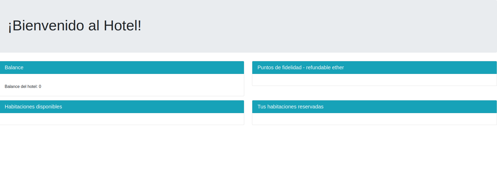

# Reserva de hotel - Ethereum DAPP
Proyecto en desarrollo. Plantaforma de reserva de habitaciones de hotel por
medio de una aplicación descentralizada.
Utiliza:
* Frontend : React
* Blockchain lang: Solidity
* Suit desarrollo: Trufle
* Servidor Blockchain : Ganache

## Esturctura del proyecto
* Contratos inteligentes: carpeta `contracts`
* Pruebas de contratos: carpeta `test`
* Front end: `src`

## Despliegue
1. Lanzar servidor de Ganache
2. Escribir `npm start`
3. Connectar wallet a Ganache
